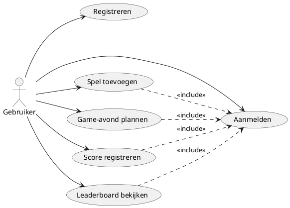
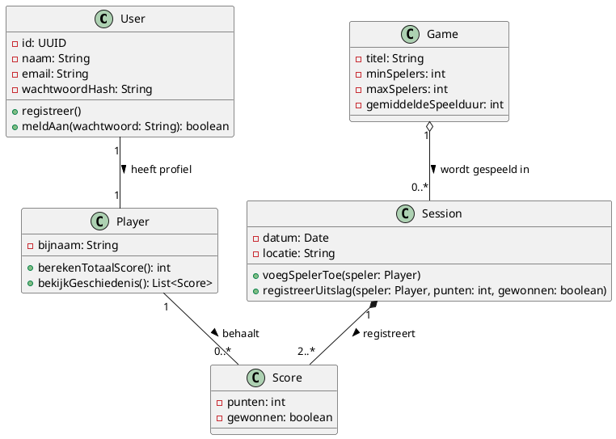
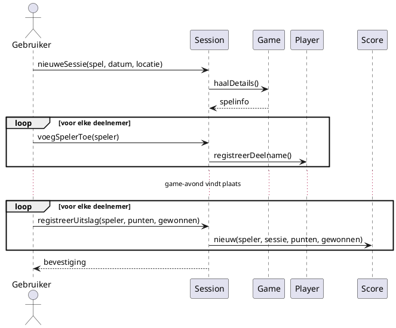

# Software Engineering Fundamentals - GameNight Hub: Week 1 (oplossing)

## User stories

1. Als gebruiker wil ik mij kunnen registreren, zodat ik toegang krijg tot GameNight Hub.
2. Als gebruiker wil ik mij kunnen aanmelden, zodat ik mijn gegevens en spellen kan beheren.
3. Als gebruiker wil ik een spel aan mijn collectie kunnen toevoegen, zodat ik kan bijhouden welke spellen ik in huis heb.
4. Als gebruiker wil ik een spel uit mijn collectie kunnen verwijderen, zodat mijn collectie up-to-date blijft.
5. Als gebruiker wil ik een game-avond kunnen plannen met datum, locatie en een spel uit mijn collectie, zodat mijn vrienden weten wanneer en waar we spelen.
6. Als gebruiker wil ik deelnemers aan een game-avond kunnen toevoegen, zodat duidelijk is wie er meespeelt.
7. Als gebruiker wil ik na afloop de uitslag van een game-avond kunnen registreren, zodat de scores bewaard blijven.
8. Als gebruiker wil ik zien wie een game-avond gewonnen heeft, zodat de competitie leeft binnen de groep.
9. Als gebruiker wil ik een leaderboard kunnen bekijken, zodat ik zie wie over alle game-avonden heen het best presteert.
10. Als gebruiker wil ik mijn eigen speelgeschiedenis kunnen bekijken, zodat ik zie aan hoeveel sessies ik al deelnam.

## Use case diagram

## Class diagram

## Sequence diagram

